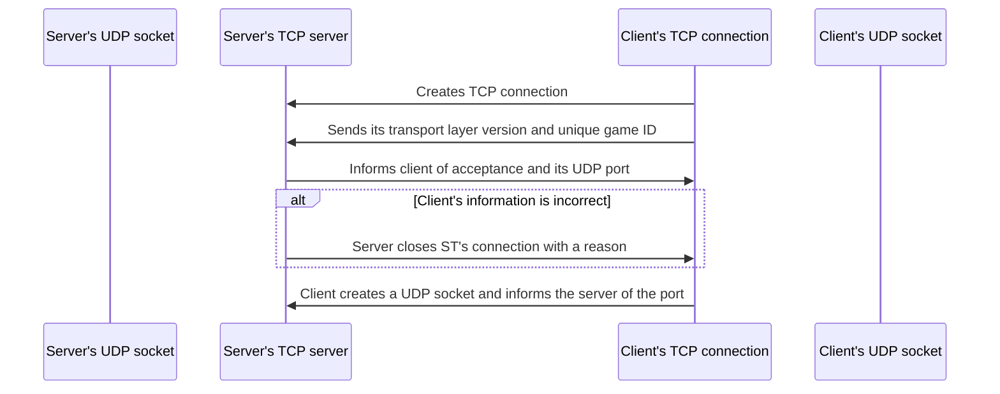

# Stardust connection process
This process runs when a client tries to connect to a server.
This only applies to the default Stardust transport layers, ie UDP.

Transport layers from other crates may have their own process.

## UDP
UDP connection initially happens over TCP by transmitting JSON documents.

Once a TCP connection is established by the standard library, the client starts by sending the version of the UDP transport layer, and a unique value that is used to verify that Stardust is configured identically on both the server and client.

<details>
<summary>Connection flowchart</summary>



</details>

<details>
<summary>Packets in transaction</summary>

```json
{
    // The version of the UDP transport layer
    "layer_version": "0.1.0",
    // The client's unique protocol hash
    "protocol": "D7799D37A7A9B082"
}
```

The server will then check the `version` and `pid` values, and send an appropriate response.

```json
// The client's connection is accepted and the server sends the UDP port it uses.
{ "response": "accepted", "port": 12345 }
```

All responses except `accepted` will have the server close the connection.

If the response is acceptance, the client will send the UDP port it will use to communicate.

```json
{ "response": "udp_port", "port": 12345 }
```
</details>

<details>
<summary>Error responses</summary>
These are the messages sent by the server to indicate a problem or non-acceptance

```json
// The layer version value is invalid
{ "response": "wrong_layer_version", "range": "=0.1.0" }
```
```json
// The pid value is incorrect
// This pid value is random and exists only for example's sake
{ "response": "wrong_pid", "srv_pid": "D7799D37A7A9B082" }
```
```json
// Too many players online
{ "response": "at_capacity" }
```
```json
// Something went wrong, the server requests the client to send the packet again
{ "response": "retry" }
```
```json
// Player is denied, no reason given.
{ "response": "denied" }
```
</details>