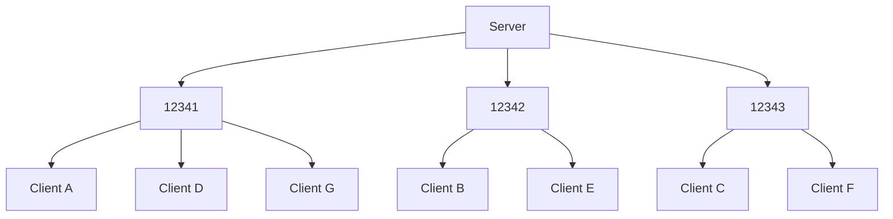

# Stardust
TODO

# UDP transport layer
## Dynamic port allocation
### Abstract
To achieve I/O parallelism while still allowing for concurrent mutable access to peer entities with minimal deferred mutations or blocking, the UDP transport layer distributes connections across a range of UDP ports. These ports are simple standard library `UdpSocket`s with an associated `Vec<Entity>`.

When new peers connect, their entity ID is added to the first bound port with the shortest list of entities, balancing the load. During I/O operations, a Bevy `TaskPool` is used to spawn a thread for every bound port. Threads then take mutable access to the port's entities using mutual exclusion. Since a peer entity is associated with only one port, this doesn't block.

### Explanation
TODO

## Channel IDs and packet headers
Each channel is first headed by three bytes, usually corresponding to the channel the message is intended for. If all three bytes are zero, it's part of the [connection protocol](#connection-protocol), which is not covered here.

TODO

## Connection protocol
Technically, Stardust has two protocols in one. Most of the time you'll be using the regular protocol, which is what most of this document is about. However, when you first join, you use a special connection protocol that operates on the same ports as the normal protocol. This is possible because all packets are headed by their associated channel ID. By shifting channel IDs from game systems by 1 during transport, we can make space for a special identifier that doesn't correspond to a channel, but is instead used to negotiate connections between peers.

From now on, we'll call all messages on this channel "zero messages". They're all packets headed by three bytes of zero, and are basically completely unrelated to the rest of the game. They even use their own, entirely distinct reliability system, which is similar to TCP. A UDP packet can only have one zero message on it, and it has to be entirely plaintext JSON.