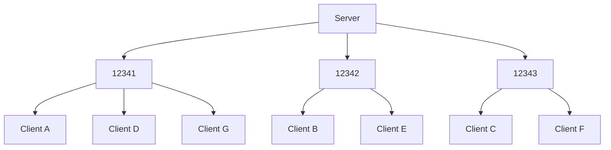

> :warning: **This is unfinished.**

# Stardust
## No concept of architecture
A lot of crates that add networking capabilities to Bevy have a specific architecture or approach in mind. Rollback, client/server, whatever. And that works fine, but Stardust is made to be as general and cover as many use cases as possible.

In service of this goal, the core of Stardust just facilitates transferring bytes, and treats all connections equally. In future, Stardust will include plugins to add functionality like marking peers as a client or server, or a member of a mesh network.

## Channels and Scheduling
"Channels" are collections of network messages accessed primarily with the Rust type system, and defined using entities and components. By making channel access use the Rust type system, and also by dividing stores of messages into typed resources, game code can queue messages for sending in parallel, using the Bevy scheduler. Channels are also accessed with a 3-byte untyped ID object, which is mostly used in transport layers.

Channels being accessed through type was a design choice made before I was aware of `SystemBuffer` and `Deferred`. However, I decided to keep it because it makes channels follow Rust's namespace publicity rules.

## Misc features
### ECS peers
Network peers are entities. This has two benefits, peers can have data attached to them with components, and it works with the Bevy scheduler.
### Protocol hash
A 'protocol value' like [the one described by Glenn Fiedler](https://www.gafferongames.com/post/virtual_connection_over_udp/) is included with Stardust. It's just a `Resource` storing a `Hasher` you can mutate through the `App` while creating it. This is included with Stardust so any and all plugins can use it without needing to know about the rest.

# UDP transport layer
## Dynamic port allocation
### Abstract
To achieve I/O parallelism while still allowing for concurrent mutable access to peer entities with minimal deferred mutations or blocking, the UDP transport layer distributes connections across a range of UDP ports. These ports are simple standard library `UdpSocket`s with an associated `Vec<Entity>`.

When new peers connect, their entity ID is added to the first bound port with the shortest list of entities, balancing the load. During I/O operations, a Bevy `TaskPool` is used to spawn a thread for every bound port. Threads then take mutable access to the port's entities using mutual exclusion. Since a peer entity is associated with only one port, this doesn't block.



### Explanation
TODO

## Channel IDs and packet headers
Each channel is first headed by three bytes, usually corresponding to the channel the message is intended for. If all three bytes are zero, it's part of the [connection protocol](#connection-protocol), which is not covered here.

TODO

### Protocol ID
Many implementations of networking code prefix all packets with a 'protocol' value, uniquely identifying the game and preventing the reading of packets not intended for it. However, this is a lot of data to repeatedly and unnecessarily send, potentially hundreds of times a second. Instead, we send the protocol ID (from the [Stardust protocol hash](#protocol-hash)) just once: when we're connecting. It's completely free to do this once they're connected - the source address is checked to access the client's payload store anyway.

### Example connection
Let's create two peers, A and B. A wants to connect to B, and B is listening for connections. A will start by sending the following to B.

```
[ 1 byte  ] Message type
[ 8 bytes ] Transport layer identifier, 64-bit unsigned integer
[ 4 bytes ] Transport version, 32-bit unsigned integer
[ 8 bytes ] Protocol hash, 64-bit unsigned integer
[ 2 bytes ] Packet sequence ID, 16-bit unsigned integer
```

If B accepts A, they respond with the following:

```
[ 1 byte  ] Message type
[ 2 bytes ] The server's reliability sequence ID
[ 2 bytes ] Port to use for further communication
```

If B rejects A, they respond with the following:

```
[ 1 byte  ] Message type
[ 2 bytes ] Rejection reason
[ ? bytes ] Attached reason data
```

The following message types are defined:
- `0` (connection request)
- `1` (connection accepted)
- `2` (connection rejected)