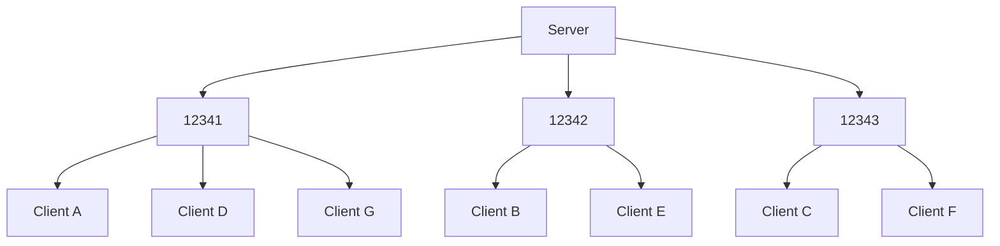

# Stardust
TODO

# UDP transport layer
## Dynamic port allocation
### Abstract
To achieve I/O parallelism while still allowing for concurrent mutable access to peer entities with minimal deferred mutations or blocking, the UDP transport layer distributes connections across a range of UDP ports. These ports are simple standard library `UdpSocket`s with an associated `Vec<Entity>`.

When new peers connect, their entity ID is added to the first bound port with the shortest list of entities, balancing the load. During I/O operations, a Bevy `TaskPool` is used to spawn a thread for every bound port. Threads then take mutable access to the port's entities using mutual exclusion. Since a peer entity is associated with only one port, this doesn't block.

### Explanation
TODO

## Channel IDs and packet headers
TODO

## Connection protocol
TODO