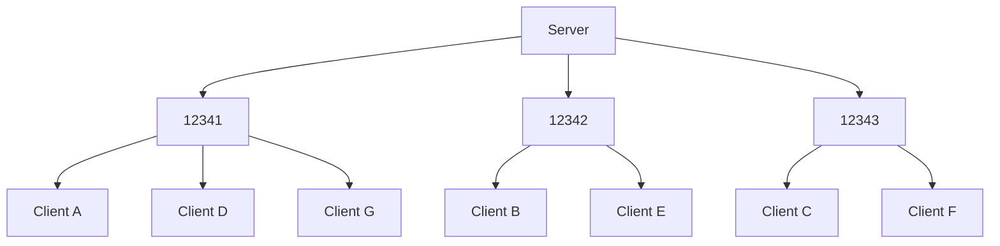

> :warning: **This is unfinished.**

# Stardust
## No concept of architecture
A lot of crates that add networking capabilities to Bevy have a specific architecture or approach in mind. Rollback, client/server, whatever. And that works fine, but Stardust is made to be as general and cover as many use cases as possible.

In service of this goal, the core of Stardust just facilitates transferring bytes, and treats all connections equally. In future, Stardust will include plugins to add functionality like marking peers as a client or server, or a member of a mesh network.

## Channels and Scheduling
"Channels" are collections of network messages accessed primarily with the Rust type system. By making channel access use the Rust type system, and also by dividing stores of messages into typed resources, game code can queue messages for sending in parallel, using the Bevy scheduler. Channels are also accessed with a 3-byte untyped ID object, which is mostly used in transport layers.

Channels being accessed through type was a design choice made before I was aware of `SystemBuffer` and `Deferred`. However, I decided to keep it because it makes channels follow Rust's namespace publicity rules.

# UDP transport layer
## The handshake
### Versioned headers
The initial handshake packet sent from a peer is prefixed both a unique number identifying the transport layer (in case of forks doing something different) and a version integer. By doing this, the handshake packet can be changed in any way that's needed as the project evolves.

However, the way that denied connections in the handshake are reported stays the same. This is because when a client is rejected, they should be informed of why. To account for future changes, the amount of possible denial reasons is `2^16`.

### Game protocol identifiers
Many implementations of networking code prefix any and all packets with a 'protocol' identifier. This is used to differentiate different games using the same client. Notable examples are [Glenn Fiedler's article][fiedler-virtual-connections], as well as the [Netcode standard](netcode-standard).

Instead of sending this data with every message, the Stardust UDP transport layer sends this during the handshake.

### Example handshake
<details>
<summary>Click to view</summary>

For this example, A is a peer trying to connect to B.

```
[ 1 byte  ] Message type (u8)
[ 8 bytes ] Transport layer identifier (u64)
[ 4 bytes ] Transport version (u32)
[ 8 bytes ] Protocol hash (u64)
[ 2 bytes ] Packet sequence ID (u16)
```

If B accepts A, they respond with the following:

```
[ 1 byte  ] Message type (u8)
[ 2 bytes ] The server's reliability sequence ID (u16)
[ 2 bytes ] Port to use for further communication (u16)
```

If B rejects A, they respond with the following:

```
[ 1 byte  ] Message type (u8)
[ 2 bytes ] Rejection reason (u16)
[ ? bytes ] Attached reason data (?)
```

The following message types are defined:
- `0` (connection request)
- `1` (connection accepted)
- `2` (connection rejected)

</details>

## Dynamic port allocation
### Abstract
To achieve I/O parallelism while still allowing for concurrent mutable access to peer entities with minimal deferred mutations or blocking, the UDP transport layer distributes connections across a range of UDP ports. These ports are simple standard library `UdpSocket`s with an associated `Vec<Entity>`.

When new peers connect, their entity ID is added to the first bound port with the shortest list of entities, balancing the load. During I/O operations, a Bevy `TaskPool` is used to spawn a thread for every bound port. Threads then take mutable access to the port's entities using mutual exclusion. Since a peer entity is associated with only one port, this doesn't block.




[fiedler-virtual-connections]: https://www.gafferongames.com/post/virtual_connection_over_udp/
[netcode-standard]: https://github.com/networkprotocol/netcode/blob/997c0e67b84bf385e9789fd7d99942cbab216c6f/STANDARD.md