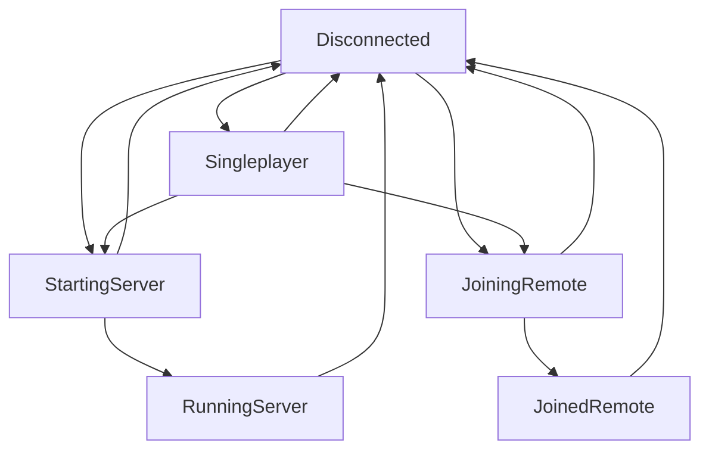

# MultiplayerState state machine

`Singleplayer` games can become `StartingServer` or `JoiningRemote` without being `Disconnected` first. This is because 'sudden multiplayer' exists, ie Dark Souls and Watch Dogs 2's invasions. Transport layers should be prepared for this sudden state change, but the specifics of how it works is up to the game developer.