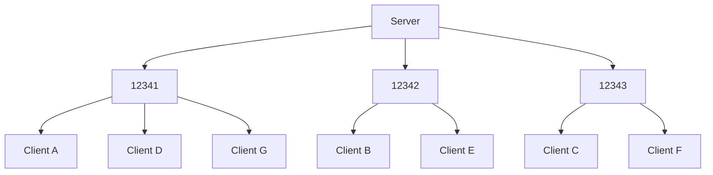

# Stardust UDP Transport Layer
Stardust's default transport layer is UDP, included with the crate.

## Negotiation
When the server is created, it binds to a special UDP socket used specifically for listening for new clients that are trying to join. This is referred to as the 'listen socket'.

The client initiates a connection by sending a 'join request' packet to the server's listen socket, consisting of a JSON message.
```jsonc
{
    // From the client
    "request": "join", // "I'd like to join the game"
    "layer_version": "0.2.0", // "I'm using UDP transport layer 0.2.0"
    "game_version": "0.1.0", // "My game is version 0.1.0"
    "pid": "42B2EC801C40258A", // "My protocol id is X"
}
```

The server, if it accepts the client, informs the client of its acceptance and includes information about itself.
```jsonc
{
    // From the server
    "response": "accepted", // "I am letting you join"
    "port": 12345 // "Use this port to talk to me"
}
```

<details>
<summary>Other possible responses</summary>

```jsonc
// Arbitrary denial reason
{ "response": "denied" }

// The client's IP is blocked
{ "response": "ip_blocked" }

// Server is full
{ "response": "player_cap_reached" }

// The client's game is outdated
{ "response": "wrong_game_version", "requires": "=0.1.0" }

// The client's transport layer is outdated
{ "response": "wrong_transport_version" }

// The client's unique hash value doesn't match the server
{ "response": "wrong_pid", "srv_pid": "42B2EC801C40258A" }
```
</details>

The negotiation stage prevents the use of a "protocol id" value being sent with every packet. By first checking it when negotiating, then adding the client to an allow-list when they're accepted, we save a few bytes.

## Scheduling
The UDP transport layer runs entirely within the Bevy scheduler, as regular Bevy systems. The receiving system runs in the `TransportReadPackets` schedule, and the sending system runs in the `TransportWritePackets` schedule. This creates a steady pattern of read-write-read-write-read-write (etc).

A side effect of this is that since packets are received and sent all at once, potentially in the thousands, a system like [using a bitfield to store acks](https://gafferongames.com/post/reliability_ordering_and_congestion_avoidance_over_udp/) is not possible. This is detailed further in the [reliability](#negative-acknowledgement-reliability) section of this document.

## Dynamic port assignment
The serverside UDP transport layer binds to a range of sockets (specified when adding the plugin to the `App`). When clients join, they are assigned to use one of the bound sockets, which permits parallelism and automatically balances load as players join. Clients will never be reassigned to a new port.

While sending or reading packets, the processing for each socket is made a task in a Bevy `TaskPool` (thread pool), allowing IO operations to execute in parallel.



## Packets
Each packet consists of a 7 byte header at minimum, containing the channel ID and ack data. The channel ID is used to dictate if more bytes indicating other header information is present, such as ordering and fragmentation information. Channels with extra features will use larger headers to store optional fields.

The term 'sequence ID' is used to refer to a 16-bit number representing the order in which packets were sent. They can be 'global' (all packets) or 'local' (one channel).

**Always present:**
- 3 byte channel id
- 2 byte highest global sequence id
- 2n byte missed global packet ids

**On reliable channels:**
- 2 byte global sequence id

**On ordered reliable channels:**
- 2 byte highest local sequence id

**On ordered channels**
- 2 byte local sequence id

## Negative acknowledgement reliability
Since the UDP transport layer operates in a receive-send loop, a sliding window solution like [Glenn Fiedler's](https://gafferongames.com/post/reliability_ordering_and_congestion_avoidance_over_udp/) imposes a limit on the amount of reliable packets sent every tick, with larger windows becoming prohibitively expensive. Instead, a round-robin negative acknowledgement system is used.

By attaching only the id of a missed packet to each sent packet, the size of a packet header can be minimised. However, negative acknowledgment requires a constant message flow to ensure functionality. The UDP transport layer will automatically send a heartbeat packet ensuring everything is working.

## Ordering