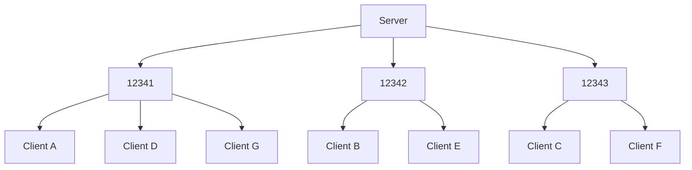

# Stardust UDP Transport Layer
Stardust's default transport layer is UDP, included with the crate.

## Negotiation
When the server is created, it binds to a special UDP socket used specifically for listening for new clients that are trying to join. This is referred to as the 'listen socket'.

The client initiates a connection by sending a 'join request' packet to the server's listen socket, consisting of a JSON message.
```jsonc
{
    // From the client
    "request": "join",
    "version": "0.2.0",
    "pid": "42B2EC801C40258A"
}
```

The server, if it accepts the client, spawns the client entity and sends a response message and the port the client will now use to communicate.
```jsonc
{
    // From the server
    "response": "accepted",
    "port": 12345
}
```

<details>
<summary>Other possible responses</summary>

```jsonc
// Denied, no reason given
{ "response": "denied" }

// The client's IP is blocked
{ "response": "ip_blocked" }

// Server is full
{ "response": "player_cap_reached" }

// The client has a different version of the Stardust UDP protocol
// This response may be removed in future.
{ "response": "wrong_version", "requires": "=0.2.0" }

// The client's unique hash value doesn't match the server
{ "response": "wrong_pid", "srv_pid": "42B2EC801C40258A" }
```
</details>

The negotiation stage prevents the use of a "protocol id" value being sent with every packet. By first checking it when negotiating, then adding the client to an allow-list when they're accepted, we save a few bytes.

## Scheduling
The UDP transport layer runs entirely within the Bevy scheduler, as regular Bevy systems. The receiving system runs in the `TransportReadPackets` schedule, and the sending system runs in the `TransportWritePackets` schedule. This creates a steady pattern of read-write-read-write-read-write (etc).

A side effect of this is that since packets are received and sent all at once, potentially in the thousands, a system like [using a bitfield to store acks](https://gafferongames.com/post/reliability_ordering_and_congestion_avoidance_over_udp/) is not possible. This is detailed further in the [reliability](#negative-acknowledgement-reliability) section of this document.

## Packets
Each packet consists of a 7 byte header at minimum, containing the channel ID and ack data. The channel ID is used to dictate if more bytes indicating other header information is present, such as ordering and fragmentation information. Channels with extra features will use larger headers to store optional fields.

Ack data is always present to ensure the functionality of reliability.

- 3 byte channel id
- 2 byte highest reliability sequence id (see [here](#negative-acknowledgement-reliability))
- 2 byte missed packet sequence id
- 2 byte reliability sequence id (optional)
- 3 byte ordering sequence id (optional)
- 3 byte fragment id (optional)
- n byte payload

## Dynamic port assignment
The serverside UDP transport layer binds to a range of sockets (specified when adding the plugin to the `App`). When clients join, they are assigned to use one of the bound sockets, which permits parallelism and automatically balances load as players join. Clients will never be reassigned to a new port.

While sending or reading packets, the processing for each socket is made a task in a Bevy `TaskPool` (thread pool), allowing IO operations to execute in parallel.



## Negative acknowledgement reliability
Due to the way the UDP transport layer executes, a solution like [Glenn Fiedler's bitfield ack system](https://gafferongames.com/post/reliability_ordering_and_congestion_avoidance_over_udp/) is not possible, as it would use more data in each packet than actual payload. Therefore, we have to make the peer only send data about lost packets.

Each reliably-sent packet is given a 24-bit 'sequence id', a globally-unique id for reliable packets. This sequence ID is created in an incrementing fashion using `local_sequence` by the sending peer.

Each peer on the connection stores two values. `local_sequence` stores the current sequence ID, incrementing every time a new reliable message needs to be sent. `remote_sequence` is the highest sequence ID value from the last frame, and is only updated at the end of receiving packets.

Each packet, regardless of if the channel is reliable, has a 'highest sequence' value, which stores the highest sequence id of all the packets sent in the current tick.

Since the receiver already knows the last highest sequence ID, it now knows the IDs of all packets it should have received. Once it has read all packets, if a packet with a sequence ID is missing, it can re-request it.

## Per-channel ordering and reliable ordered channels
Ordered channels also contain a similar 'sequence ID', except it's local to that channel. Received packets are simply inserted into the `IncomingNetworkMessages` component in the order of their sequence IDs.

Reliable ordered channels contain both a global sequence ID and a local sequence ID.

## Fragmentation
TODO