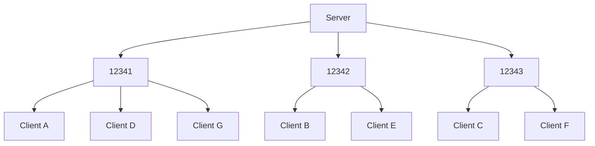

# Stardust UDP Transport Layer
Stardust's default transport layer is UDP, included with the crate.

## Negotiation
When the server is created, it binds to a special UDP socket used specifically for listening for new clients that are trying to join. This is referred to as the 'listen socket'.

The client initiates a connection by sending a 'join request' packet to the server's listen socket, consisting of a JSON message.
```json
{
    // From the client
    "request": "join",
    "version": "0.1.0",
    "pid": "42B2EC801C40258A"
}
```

The server, if it accepts the client, sends a response message and the port the client will now use to communicate.
```json
{
    // From the server
    "response": "accepted",
    "port": 12345
}
```

<details>
<summary>Other possible responses</summary>

```json
// Denied, no reason given
{ "response": "denied" }

// The client's IP is blocked
{ "response": "ip_blocked" }

// Server is full
{ "response": "player_cap_reached" }

// The client has a different version of the Stardust UDP protocol
// This response may be removed in future.
{ "response": "wrong_version", "requires": "=0.1.0" }

// The client's unique hash value doesn't match the server
{ "response": "wrong_pid", "srv_pid": "42B2EC801C40258A" }
```
</details>

## Packets
Each packet consists of a 7 byte header at minimum, containing the channel ID and ack data. The channel ID is used to dictate if more bytes indicating other header information is present, such as ordering and fragmentation information. Channels with extra features will use larger headers to store optional fields.

Ack data is always present to ensure the functionality of reliability.

```
3 byte channel id
4 byte ack data
3 byte sequence id (optional)
3 byte fragment id (optional)
n byte payload
```

## Dynamic port assignment
The serverside UDP transport layer binds to a range of sockets (specified when adding the plugin to the `App`). When clients join, they are assigned to use one of the bound sockets, which permits parallelism and automatically balances load as players join. Clients will never be reassigned to a new port.

While sending or reading packets, the processing for each socket is made a task in a Bevy `TaskPool` (thread pool), allowing IO operations to execute in parallel.

