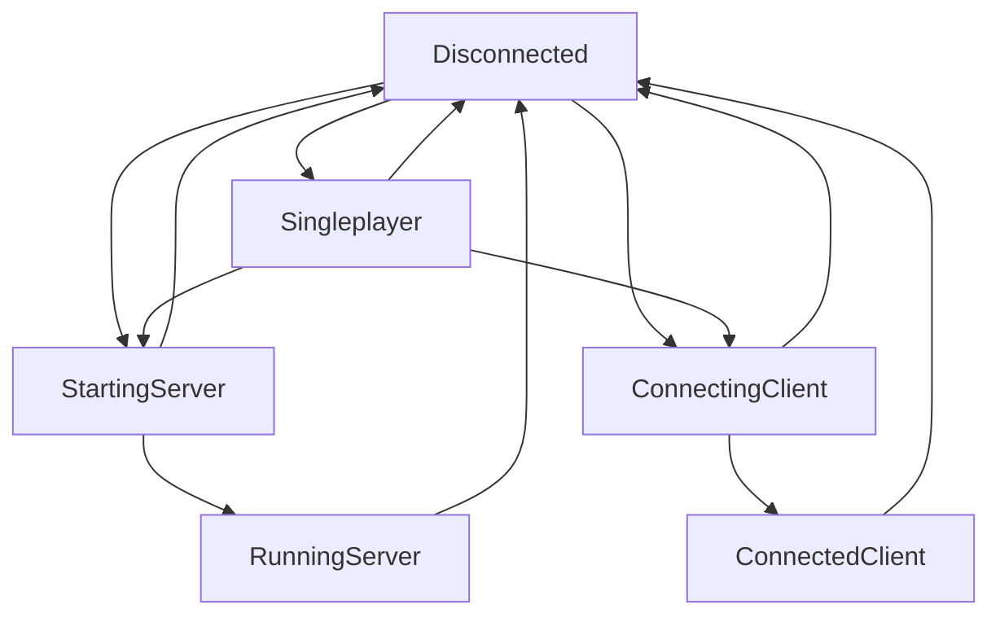

# Using Stardust

## Terminology
- **Channels:** A system of compartmentalising network messages, primarily utilised with Rust's type system.
- **Transport layer:** Code that deals with sending octet strings over the internet, using protocols like UDP or WebRTC.
- **Octet string:** An arbitrary-length array of octets (bytes) that is used by the transport layer to transmit information over a given medium (usually the Internet)

## Setup
Please note that for all setup, the order of operations does matter. Registering channel A before channel B on the server, and vice versa on the client, will prevent the client from joining the server.

### Plugins
Your average `App` will have two plugins: the core plugin and a transport layer.

The core plugin looks like this:
```rs
pub struct StardustPlugin {
    pub version: Version,
    pub allows: VersionReq,
    pub mode: MultiplayerMode,
}
```

`version` and `allows` are pretty simple. `allows` is the versions of the game that your app can connect to, or accept connections from. `version` is the current version of the app. These two values are used to compare against incoming connections, preventing different versions of the game from joining eachother. Keeping these values correct is **very important**.

`mode` defines what kind of multiplayer you want. For example, if you were running a dedicated server, you would use `MultiplayerMode::DedicatedServer`. This value will enable or disable certain features and functionality from your app, and can change how other plugins will function.

You can use the following table to idenfity what value you want to use here.
| Can host | Can join | Can be singleplayer | Variant                       |
| -------- | -------- | ------------------- | ----------------------------- |
| Yes      | No       | No                  | DedicatedServer               |
| No       | Yes      | No                  | DedicatedClient               |
| Yes      | Yes      | No                  | ClientAndHost                 |
| No       | Yes      | Yes                 | ClientWithSingleplayer        |
| Yes      | Yes      | Yes                 | ClientAndHostWithSingleplayer |

### Channels
Channels are used to compartmentalise network messages for better parallelism and to better suit the ECS design. They are primarily accessed using generic type APIs, though untyped APIs exist for use by transport layers. The generic type you use when creating the channel can then be used to refer back to it as a system parameter.

Creating a channel is done with the `register_channel` function, which can be used on the `App`. `register_channel` has one generic type for your channel type, and a `impl Bundle + Hash` argument. The `Bundle` is used to to configure the channel, such as setting direction and reliability.

Stardust has the following components you can add to configure a channel.
> Note: Items marked with 🟡 means that the related functionality is not yet present.
- `DirectionalChannel`
    - Enables channel directionality. Packets flowing in the wrong direction will be ignored.
    - With the UDP transport layer, this will panic if it occurs on the client.
- `OrderedChannel`
    - Enables ordering. Packets will be sorted so when read, they are in the order they are sent.
    - This by itself does not guarantee that the packets arrive at all, just that they're in order.
- `ReliableChannel`
    - Enables reliability. All packets sent over this channel are requested to be resent if they don't arrive.
    - This is not a fast process. With high latency, a package can arrive several seconds after it's sent.
    - With `OrderedChannel`, this can block all messages on the channel from being read until every packet is retrieved.
- 🟡 `ChannelLatestness`
    - Discards messages that are a certain amount of ticks old.
- 🟡 `FragmentedChannel`
    - If an octet string is too large to send in one packet, it will be broken into multiple packets for transmission.
    - Fragmentation channels implement their own kind of reliability, for single messages.
- 🟡 `CompressedChannel`
    - Octet strings in this channel will be run through a compression algorithm before transmission.
    - This can be useful with `FragmentedChannel` if your message is really, really big.

Usage example:
```rs
#[derive(Debug, TypePath)]
struct MyChannel;

app.register_channel::<MyChannel>(ReliableChannel);
```

## Writing systems
SystemParams like `ChannelReader<T>` and `ChannelWriter<T>` have two versions for the client and server respectively. While they have the same name, they are in different namespaces and have different functionality. Make sure you're using the right one!

### State machine
Stardust uses a state machine used to determine what the app is currently doing, accessible with `Res<State<MultiplayerState>>`.



This is all possible states Stardust can be in, and all the state changes that are possible. There are only six states an app can be in, with some nuance.

- `Disconnected` means that the app has no current connection. This is useful for if you have a main menu, or some other interface for setting up multiplayer.
    - All apps start in this state by default, with the exception of `DedicatedServer`, which defaults to `StartingServer`. 
- `Singleplayer` is for when the app is in a 'singleplayer' mode, where there may still be simulation, but there is no multiplayer connections. There isn't really much of a reason for this state to exist, but it could still be useful.
    - `Singleplayer` can change to `StartingServer` or `ConnectingClient` without changing to `Disconnected`. The reason this exists is for 'sudden multiplayer', like Dark Souls and Watch Dogs 2's invasion mechanics.
- `StartingServer` is used for setting up the server, ie binding to sockets and polling authentication services. This is its own state so it can happen across ticks.
- `RunningServer` is a state representing that the server is running. This includes accepting remote connections, etc. The server should be listening to and sending data in this state.
- `ConnectingClient` is used for when the app is trying to join a remote server. This isn't necessarily success, just that there is an ongoing attempt.
- `ConnectedClient` is used for when the app is connected to a remote server. The client should be listening to and sending data in this state.

States that don't make sense with the app `MultiplayerMode` and impossible state changes will panic.

### Reading
Reading systems must be in the `ReadOctetStrings` schedule to function.

To read from a channel, add `ChannelReader<T>` as a system parameter, and use an appropriate function: `read_all` and `read_client` on the server, and `read_all_from_server` on the client. All functions will panic if `T` does not exist.

Both functions return an iterator with an `Item` of `&Payloads`. A `Payloads` object is a simple tuple struct holding a `Vec<Payload>`.

A `Payload` object contains an `OctetString`, which is basically just an `Arc` of bytes. Octet strings are pre-processed by transport layers, and are free of any extra data. You can use `read` to access a slice of the octet string.

Note that `Payload`s may have bytes hidden from both the head and tail. You can increase the amount with `hide` but you can't unhide bytes.

`Payload` objects can be cloned freely. Holding them will keep the `OctetString` in memory, so make sure to destroy them when you're no longer using them.

### Writing
Writing systems can be any schedule that runs before `TransportWritePackets`, such as `Update`.

To write to a channel, add `ChannelWriter<T>` as a system parameter. Both the server and the client have a function called `send` that takes any `impl Into<OctetString>`, but the server has an additional `SendTarget` argument, specifying who should receive the message.

Send exactly what you intend to be received - the transport layer deals with all processing before sending it over the network.