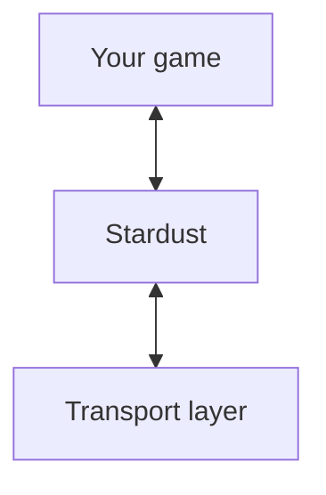

# How to use Stardust
If this is your first time using Stardust, go [here](#internal-structure) to see an overview of how Stardust works and all the terms in play.

**TODO**

# Internal structure
Before using Stardust, it's important to know what it does, and why it does it, especially since Stardust does networking very differently to other solutions.

## Octet strings
An 'octet string' is essentially an `Arc<Vec<u8>>`. It's an arbitrarily long series of octets (aka bytes) that is free of any artifacts from transmission, received *exactly* as they are sent. Octet strings can be cloned cheaply, and kept around until no longer needed - due to using an `Arc`, you just drop the reference and it's freed from memory, assuming there's no other references.

## Layers
Stardust divides networking into three layers:

Stardust, at its core, acts as an interface between your game code and whatever's interacting with other computers, aka the transport layer. This abstraction allows you to write the same code no matter how information is actually being exchanged.

The transport layer largely doesn't matter once the app starts. Once it's added to the `App`, it should handle new connections all by itself. The way you interact with a transport layer (ie, creating a connection) is entirely up to that crate.

## Schedules
Stardust operates using Bevy schedules, in this cycle.

> 1. PreUpdate
>    1. TransportReadPackets
>    2. ReadOctetStrings
> 2. Update
> 3. PostUpdate
>    1. TransportSendPackets

First, in `PreUpdate`, the `TransportReadPackets` schedule is run. This is where transport layers process incoming data and write octet strings for reading by your systems.

`ReadOctetStrings` is where most systems that read octet strings should be placed. Since they run in `PreUpdate`, you can mutate the world before any other game systems are run, preventing system order related issues with plugins that aren't aware of Stardust. You can still read octet strings in `Update`, but be aware of potential issues.

`TransportSendPackets` is just where transport layers send any octet strings you've written. After this, buffers are cleared. Messages do not persist across ticks, unless you or the transport layer clone the octet string.

## Channels
Channels are used to classify and compartmentalise stores of octet strings. They are primarily accessed with Rust's type system, using essentially any type you want, as long as it implements `Debug` and `TypePath`. By doing this, the Bevy scheduler can identify mutable accesses to channels in different systems, and allow non-conflicting systems to run in parallel.

Registering a channel creates a new `ChannelId`, a sequential 3-byte integer representing that channel without any type information. This is also used by transport layers to access all channels without having to know every type.

## Protocol ID
When you add the `StardustPlugin` plugin, it will create a new hasher that will be used to generate the "protocol ID" of your app - a unique number that prevents peers with different configurations from connecting to eachother.

Every time you change the `App` in a way that's related to how information will be sent over the network, it's added to the hasher, such as registering a new channel. It's important this is done in the same order, every single time.