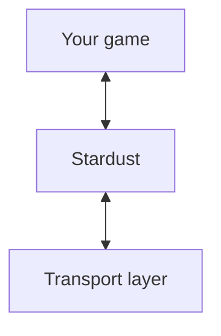

# What Stardust does
Before using Stardust, it's important to know what it does, and why it does it, especially since Stardust does networking very differently to other solutions.

## Octet strings
An 'octet string' is essentially an `Arc<Vec<u8>>`. It's an arbitrarily long series of octets (aka bytes) that is free of any artifacts from transmission. Octet strings should be received *exactly* as they are sent.

Octet strings can be cloned cheaply, and kept around until no longer needed - due to using an `Arc`, you just drop the reference and it's freed from memory, assuming there's no other references.

## Layers
Stardust divides networking into three layers:

Stardust, at its core, acts as an interface between your game code and whatever's interacting with other computers, aka the transport layer. This abstraction allows you to write the same code no matter how information is actually being exchanged.

The transport layer largely doesn't matter once the app starts. Once it's added to the `App`, it should handle new connections all by itself.

## Schedules
Stardust operates using Bevy schedules, in this cycle.

> 1. PreUpdate
>    1. TransportReadPackets
>    2. ReadOctetStrings
> 2. Update
> 3. PostUpdate
>    1. TransportSendPackets

First, in `PreUpdate`, the `TransportReadPackets` schedule is run. This is where transport layers process incoming data and write octet strings for reading by your systems.

## Channels
**TODO**

# How to use Stardust
**TODO**